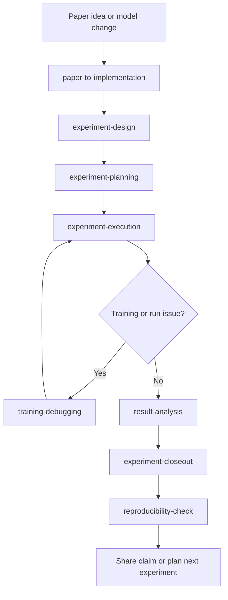

# Superpowers DL

**English** | [简体中文](README.zh-CN.md)

Deep learning research workflows for agentic coding tools.

`superpowers_DL` is a research-focused fork of the original Superpowers project. The upstream project is strong for general software engineering. This fork is for model work: define a hypothesis, design the smallest falsifiable experiment, execute it with provenance, debug failures, analyze evidence, and only then claim an improvement.

## Why This Fork Exists

Most deep learning iteration breaks down for process reasons, not typing speed:

- code changes start before the hypothesis, baseline, and metric are fixed
- multiple variables get changed in the same experiment pass
- training failures get "fixed" by folklore instead of root-cause isolation
- single lucky runs get treated as established results
- configs, seeds, commits, and artifacts go missing when results need to be shared

`superpowers_DL` turns those failure points into explicit skills and guardrails.

## Who It Is For

Use this fork if your work looks like:

- paper reproduction
- architecture, loss, augmentation, or schedule changes
- training-debugging and experiment triage
- baseline and ablation comparison
- reproducibility checks before sharing numbers

If you mainly need generic product-engineering workflows, use upstream Superpowers instead.

## What Changed From Upstream

- Software-engineering workflow skills were removed.
- The repository was rebuilt around deep learning experiment design, execution, debugging, interpretation, and reproducibility.
- Installation examples in this repository point to this fork, not the upstream `obra/superpowers` repository.

## Research Workflow

This fork is organized around a repeatable research loop:



1. `paper-to-implementation`
   Translate a paper idea into the smallest faithful local experiment.
2. `experiment-design`
   Lock the hypothesis, baseline, metric, dataset assumptions, and compute budget before coding.
3. `experiment-planning`
   Turn the design into concrete code changes, sanity checks, runs, and artifact capture.
4. `experiment-execution`
   Execute the plan while keeping changes controlled and provenance intact.
5. `training-debugging`
   Handle NaNs, divergence, OOMs, inconsistent metrics, and other failures systematically.
6. `result-analysis`
   Decide what the evidence supports across baselines, ablations, and reruns.
7. `experiment-closeout`
   Make an explicit keep-or-revert decision after the run.
8. `reproducibility-check`
   Verify the command, config, seeds, commit, dataset version, artifacts, and metric table before making a claim.

`using-superpowers` is injected at session start on supported platforms so research tasks route into the right workflow early.

## Included Skills

| Skill | Purpose |
| --- | --- |
| `paper-to-implementation` | Separate a paper's core intervention from hidden assumptions and map it into local code. |
| `experiment-design` | Convert a rough idea into a falsifiable experiment card. |
| `experiment-planning` | Produce an execution plan with exact files, commands, checks, and saved artifacts. |
| `experiment-execution` | Implement and run the smallest decisive experiment first. |
| `training-debugging` | Isolate and prove the root cause of training failures. |
| `result-analysis` | Compare baselines and reruns conservatively and decide next actions. |
| `experiment-closeout` | Decide whether experiment-specific code should stay or be reverted. |
| `reproducibility-check` | Gate performance claims on attached evidence. |
| `using-superpowers` | Enforce skill-first behavior at the start of a session. |

## Quick Start

Install the fork into your agent environment, then describe the research task naturally.

Example prompts:

- "I want to try rotary embeddings in this model."
- "Training goes to NaN after warmup."
- "Compare these ablations and tell me what to run next."
- "Help me reproduce this paper fairly."
- "I changed the loss and validation improved once. What evidence do I still need?"

You can also invoke skills explicitly, for example `use experiment-design` or `use training-debugging`.

## Installation

Use the installation docs in this repository rather than the upstream marketplace entries.

### Codex

Tell Codex:

```text
Fetch and follow instructions from https://raw.githubusercontent.com/ShunyangLiu/superpowers_DL/refs/heads/main/.codex/INSTALL.md
```

Manual guide: [docs/README.codex.md](docs/README.codex.md)

### OpenCode

Tell OpenCode:

```text
Fetch and follow instructions from https://raw.githubusercontent.com/ShunyangLiu/superpowers_DL/refs/heads/main/.opencode/INSTALL.md
```

Manual guide: [docs/README.opencode.md](docs/README.opencode.md)

### Gemini CLI

```bash
gemini extensions install https://github.com/ShunyangLiu/superpowers_DL
```

### Claude Code / Cursor

The repository includes `.claude-plugin/` and `.cursor-plugin/` metadata for local packaging. This fork is not documented here as an official marketplace release for those platforms.

## Principles

- hypothesis before implementation
- smallest falsifiable experiment first
- fair baselines before comparisons
- failed experiments archived before code is discarded
- evidence over intuition
- reproducibility over storytelling

## Repository Layout

- `skills/`: research workflow skills
- `commands/`: lightweight shortcuts to core skills
- `hooks/`: session-start hooks for supported platforms
- `agents/`: reusable reviewer agents
- `docs/`: platform-specific installation docs and project notes
- `tests/`: skill-triggering and platform smoke tests

## Contributing

Add or edit skills directly in `skills/`.

- Keep each `SKILL.md` concise.
- Move heavy detail into `references/` when needed.
- Update tests when you add a trigger path or change expected routing behavior.

## License

MIT License
